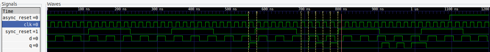
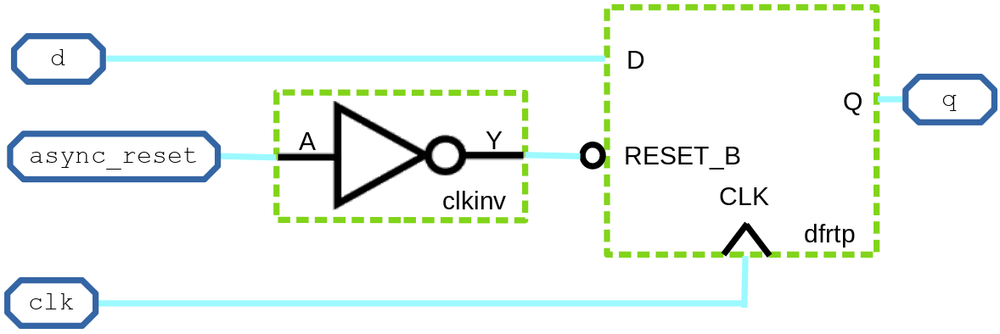
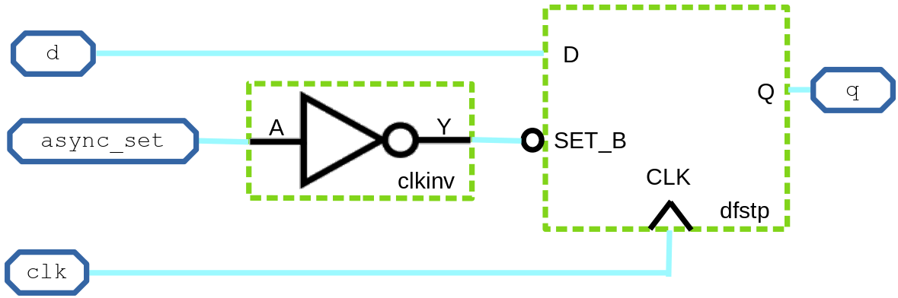

<details>
<summary>Verilog RTL design and synthesis</summary>
  
  #### - Lab2: iverilog and GTKWave
  Functional verification (Boolean simulation: i.e., zero delays)
  ```
  $ git clone https://github.com/kunalg123/sky130RTLDesignAndSynthesisWorkshop.git
  $ cd sky130RTLDesignAndSynthesisWorkshop/verilog_files
  $ iverilog good_mux.v tb_good_mux.v
  $ ./a.out
  $ gtkwave tb_good_mux.vcd
  ```
  

  #### - Lab3: Yosys and abc
  - Logical synthesis
    
  > [!WARNING]
  > Note the library name...
  ```
  $ yosys
  > read_liberty -lib ../lib/sky130_fd_sc_hd__tt_025C_1v80_nomux.lib
  > read_verilog good_mux.v
  > synth -top good_mux
  ```
  

  - Mapping to a given technology (Sky130 standard cells in this case) using [ABC](https://people.eecs.berkeley.edu/~alanmi/abc/)
  ```
  > abc -liberty ../lib/sky130_fd_sc_hd__tt_025C_1v80_nomux.lib
  > show
  ```
  

  ```
  > write_verilog -noattr good_mux_netlist.v
  > exit
  ```
  - Resulting schematic using Sky130 standard cells
  
</details>

<details>
<summary>Timing libs, hierarchical vs flat synthesis, and efficient flop coding styles</summary>

  #### - Lab5: Hierarchical vs Flat Synthesis
  ```
  $ cd sky130RTLDesignAndSynthesisWorkshop/verilog_files
  $ yosys
  > read_liberty -lib ../lib/sky130_fd_sc_hd__tt_025C_1v80.lib
  > read_verilog multiple_modules.v
  > synth -top multiple_modules
  > abc -liberty ../lib/sky130_fd_sc_hd__tt_025C_1v80.lib
  > show multiple_modules
  ```
  - Resulting schematic
  

  ```
  > write_verilog -noattr multiple_modules_hier.v
  ```
  - Resulting Verilog netlist
  

  ```
  > show sub_module1
  ```
  - Resulting schematic using Sky130 standard cells
  

  ```
  > show sub_module2
  ```
  - Resulting schematic using Sky130 standard cells
  

  #### - Various Flip-Flop Coding Styles

  ##### - Asynchronous Reset DFF - functional simulation
  ```
$ iverilog dff_asyncres.v tb_dff_asyncres.v
$ ./a.out
$ gtkwave tb_dff_asyncres.vcd
  ```


  ##### - Synchronous Set DFF - functional simulation
  ```
$ iverilog dff_async_set.v tb_dff_async_set.v
$ ./a.out
$ gtkwave tb_dff_async_set.vcd
  ```


  ##### - Synchronous Reset DFF - functional simulation
  ```
$ iverilog dff_syncres.v tb_dff_syncres.v
$ ./a.out
$ gtkwave tb_dff_syncres.vcd
  ```


  ##### - Asynchronous Reset, Synchronous Reset DFF - functional simulation
  ```
$ iverilog dff_asyncres_syncres.v tb_dff_asyncres_syncres.v
$ ./a.out
$ gtkwave tb_dff_asyncres_syncres.vcd
  ```


  ##### - Asynchronous Reset DFF - synthesis
  ```
$ yosys

> read_liberty -lib ../lib/sky130_fd_sc_hd__tt_025C_1v80.lib

> read_verilog dff_asyncres.v
> synth -top dff_asyncres
> dfflibmap -liberty ../lib/sky130_fd_sc_hd__tt_025C_1v80.lib
> abc -liberty ../lib/sky130_fd_sc_hd__tt_025C_1v80.lib
> show
  ```



  ##### - Asynchronous Set DFF - synthesis
  ```
> read_verilog dff_async_set.v
> synth -top dff_async_set
> dfflibmap -liberty ../lib/sky130_fd_sc_hd__tt_025C_1v80.lib
> abc -liberty ../lib/sky130_fd_sc_hd__tt_025C_1v80.lib
> show
  ```



  ##### - Synchronous Reset DFF - synthesis
  ```
> read_verilog dff_syncres.v
> synth -top dff_syncres
> dfflibmap -liberty ../lib/sky130_fd_sc_hd__tt_025C_1v80.lib
> abc -liberty ../lib/sky130_fd_sc_hd__tt_025C_1v80.lib
> show
  ```


#### - Interesting optimisations

##### - Multiplying by two - synthesis
```
$ yosys
> read_liberty -lib ../lib/sky130_fd_sc_hd__tt_025C_1v80.lib

> read_verilog mult_2.v
> synth -top mul2
> abc -liberty ../lib/sky130_fd_sc_hd__tt_025C_1v80.lib
> show
```


##### - Multiplying by eight - synthesis

  > [!WARNING]
  > It is actually multiplying by nine
```
> read_verilog mult_8.v
> synth -top mult8
> abc -liberty ../lib/sky130_fd_sc_hd__tt_025C_1v80.lib
> show
```


</details>

<details>
<summary>Combinational and sequential optimizations</summary>

  #### - Sequential logic optimizations
  ```
  $ cd sky130RTLDesignAndSynthesisWorkshop/verilog_files
  $ iverilog dff_const3.v tb_dff_const3.v
  $ gtkwave tb_dff_const3.vcd
  ```

  ```
  $ yosys
  > read_liberty -lib ../lib/sky130_fd_sc_hd__tt_025C_1v80.lib
  > read_verilog dff_const3.v
  > synth -top dff_const3
  > dfflibmap -liberty ../lib/sky130_fd_sc_hd__tt_025C_1v80.lib
  > abc -liberty ../lib/sky130_fd_sc_hd__tt_025C_1v80.lib
  > show
  ```
  

</details>

<details>
<summary>Gate-Level Simulation, blocking vs non-blocking, and Synthesis-Simulation mismatches</summary>

</details>
