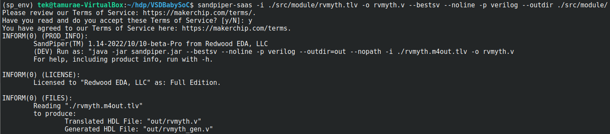
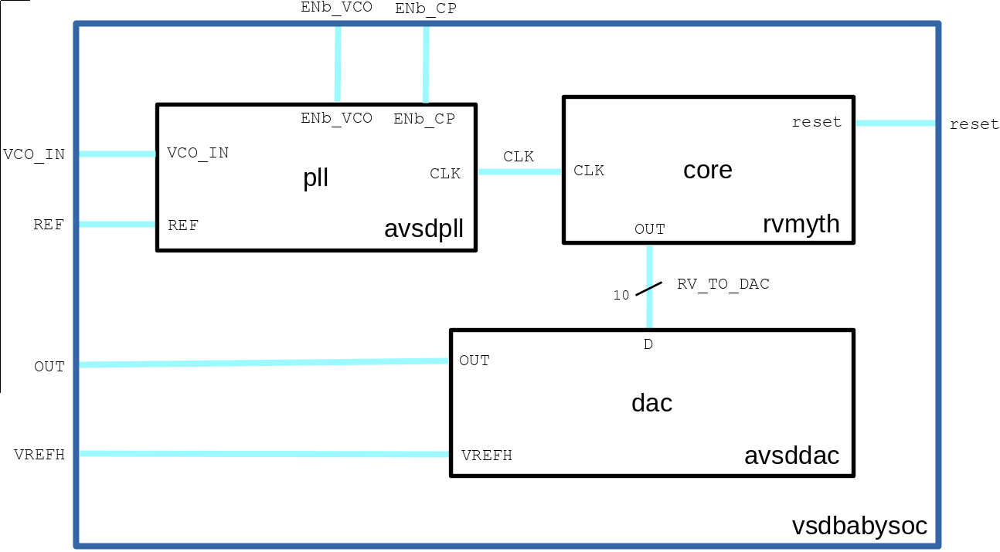
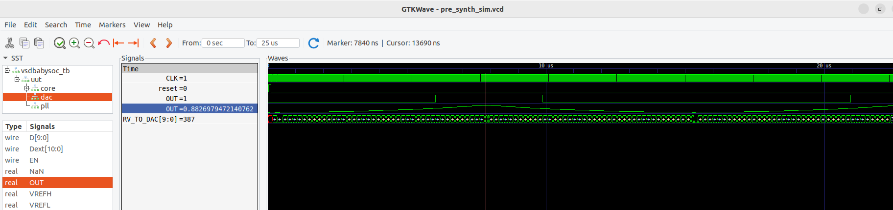

## VSDBabySoC

<details>
<summary>VSDBabySoC Components</summary>

  [VSDBabySoC](https://github.com/manili/VSDBabySoC): Top level module.
  ```
  git clone https://github.com/manili/VSDBabySoC.git
  ``` 
  [RISC-V MYTH processor](https://github.com/stevehoover/RISC-V_MYTH_Workshop): A 32-bit processor based on the RISC-V architecture.
  ```
  git clone https://github.com/kunalg123/rvmyth.git
  ``` 
  [PLL module](https://github.com/lakshmi-sathi/avsdpll_1v8): A Phase-Locked Loop (PLL) is used to generate stable clock signals for the SoC.
  ```
  git clone https://github.com/lakshmi-sathi/avsdpll_1v8.git
  ```  
  [DAC module](https://github.com/vsdip/rvmyth_avsddac_interface): A Digital-to-Analogue Converter (DAC) is used to generate an analogue signal from a digital value.
  ```
  git clone https://github.com/vsdip/rvmyth_avsddac_interface.git
  ```
  

</details>

> [!IMPORTANT]
> The RTL for the RISC-V MYTH processor is written using [TL-Verilog](https://github.com/TL-X-org/TL-V_Projects) (Transaction-Level Verilog), a Verilog extension

<details>
<summary>TL-Verilog to Verilog Conversion for RISC-V MYTH</summary>
  
  ```
  $ cd VSDBabySoC
  $ python3 -m venv sp_env
  $ source sp_env/bin/activate
  (sp_env) pip install pyyaml click sandpiper-saas
  (sp_env) sandpiper-saas -i ./src/module/rvmyth.tlv -o rvmyth.v --bestsv --noline -p verilog --outdir ./src/module/
  ```
  

  ```
  (sp_env) deactivate
  ```
</details>

<details>
<summary>Block Diagram</summary>
  
  

</details>

<details>
<summary>Functional Simulation</summary>
  
  #### - Pre-Synthesis
  ```
$ mkdir -p output/pre_synth_sim
$ iverilog -o ./output/pre_synth_sim/pre_synth_sim.out -DPRE_SYNTH_SIM \
-I ./src/include -I ./src/module ./src/module/testbench.v

$ cd output/pre_synth_sim
$ ./pre_synth_sim.out
$ gtkwave pre_synth_sim.vcd
  ```
  

</details>

> [!IMPORTANT]
> The signals in the previous waveforms correspond to those at the top-level module (i.e., vsdbabysoc), except for the second '''OUT''' signal, which corresponds to the '''reg  real OUT''' variable in the '''dac''' instance of the '''avsddac''' module.

