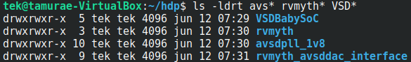

<details>
<summary>VSDBabySoC</summary>
  
  #### - VSDBabySoC Components
  [VSDBabySoC](https://github.com/manili/VSDBabySoC): Top level module.
  ```
  git clone https://github.com/manili/VSDBabySoC.git
  ``` 
  [RISC-V MYTH processor](https://github.com/stevehoover/RISC-V_MYTH_Workshop): A 32-bit processor based on the RISC-V architecture.
  ```
  git clone https://github.com/kunalg123/rvmyth.git
  ``` 
  [PLL module](https://github.com/lakshmi-sathi/avsdpll_1v8): A Phase-Locked Loop (PLL) is used to generate stable clock signals for the SoC.
  ```
  git clone https://github.com/lakshmi-sathi/avsdpll_1v8.git
  ```  
  [DAC module](https://github.com/vsdip/rvmyth_avsddac_interface): A Digital-to-Analogue Converter (DAC) is used to generate an analogue signal from a digital value.
  ```
  git clone https://github.com/vsdip/rvmyth_avsddac_interface.git
  ```
  

</details>

> [!IMPORTANT]
> The RTL for the RISC-V MYTH processor is written using [TL-Verilog](https://github.com/TL-X-org/TL-V_Projects) (Transaction-Level Verilog), a Verilog extension

<details>
<summary>TLV to Verilog Conversion for RISC-V MYTH</summary>
  
  #### - TLV to Verilog Conversion for RISC-V MYTH
</details>
