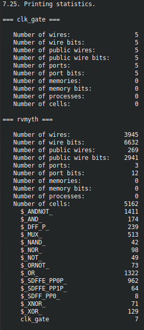
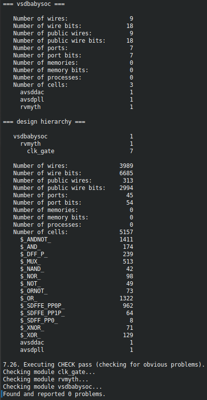
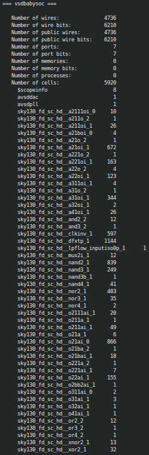
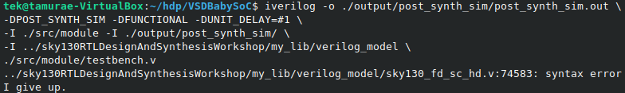
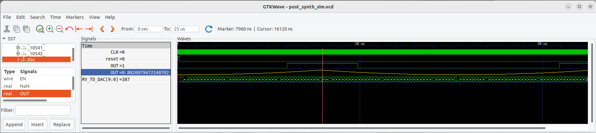
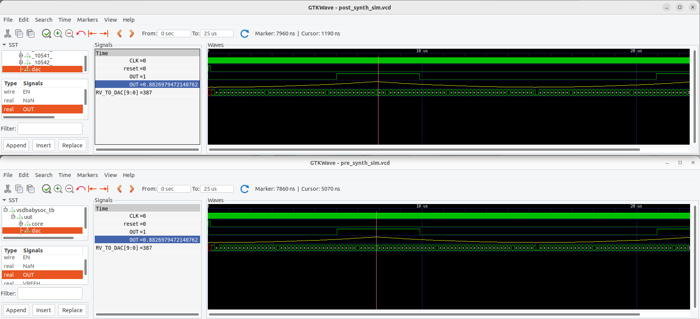

## VSDBabySoC - Synthesis and Functional Simulation

<details>
<summary>VSDBabySoC Components</summary>

  [VSDBabySoC](https://github.com/manili/VSDBabySoC): Top level module.
  ```
  git clone https://github.com/manili/VSDBabySoC.git
  ``` 
  [RISC-V MYTH processor](https://github.com/stevehoover/RISC-V_MYTH_Workshop): A 32-bit processor based on the RISC-V architecture.
  ```
  git clone https://github.com/kunalg123/rvmyth.git
  ``` 
  [PLL module](https://github.com/lakshmi-sathi/avsdpll_1v8): A Phase-Locked Loop (PLL) is used to generate stable clock signals for the SoC.
  ```
  git clone https://github.com/lakshmi-sathi/avsdpll_1v8.git
  ```  
  [DAC module](https://github.com/vsdip/rvmyth_avsddac_interface): A Digital-to-Analogue Converter (DAC) is used to generate an analogue signal from a digital value.
  ```
  git clone https://github.com/vsdip/rvmyth_avsddac_interface.git
  ```
  

</details>

> [!IMPORTANT]
> The RTL for the RISC-V MYTH processor is written using [TL-Verilog](https://github.com/TL-X-org/TL-V_Projects) (Transaction-Level Verilog), a Verilog extension

<details>
<summary>TL-Verilog to Verilog Conversion for RISC-V MYTH</summary>
  
  ```
  $ cd VSDBabySoC
  $ python3 -m venv sp_env
  $ source sp_env/bin/activate
  (sp_env) pip install pyyaml click sandpiper-saas
  (sp_env) sandpiper-saas -i ./src/module/rvmyth.tlv -o rvmyth.v --bestsv --noline -p verilog --outdir ./src/module/
  ```
  

  ```
  (sp_env) deactivate
  ```
</details>

<details>
<summary>Block Diagram</summary>
  
  

</details>

<details>
<summary>Functional Simulation</summary>
  
  #### - Pre-Synthesis
  ```
$ mkdir -p output/pre_synth_sim
$ iverilog -o ./output/pre_synth_sim/pre_synth_sim.out -DPRE_SYNTH_SIM \
-I ./src/include -I ./src/module ./src/module/testbench.v

$ cd output/pre_synth_sim
$ ./pre_synth_sim.out
$ gtkwave pre_synth_sim.vcd
  ```
  

</details>

> [!IMPORTANT]
> The signals in the previous waveforms correspond to those at the top-level module (i.e., vsdbabysoc), except for the second ''OUT'' signal, which corresponds to the ''reg  real OUT'' variable in the ''dac'' instance of the ''avsddac'' module. Note that you need to change this signal ''Data Format'' to ''Analog → Interpolated''

<details>
<summary>Logical Synthesis, Mapping, and Gate-Level Functional Simulation</summary>

  #### - Logical Synthesis
  ```
  $ cd VSDBabySoC
  $ mkdir -p output/post_synth_sim

  $ yosys

  > read_verilog ./src/module/vsdbabysoc.v
  > read_verilog -I ./src/include/ ./src/module/rvmyth.v
  > read_verilog -I ./src/include/ ./src/module/clk_gate.v

  > read_liberty -lib ./src/lib/avsdpll.lib
  > read_liberty -lib ./src/lib/avsddac.lib
  > read_liberty -lib ./src/lib/sky130_fd_sc_hd__tt_025C_1v80.lib

  > synth -top vsdbabysoc
  ```
  
  

  #### - Mapping
  ```
  > dfflibmap -liberty ./src/lib/sky130_fd_sc_hd__tt_025C_1v80.lib

  > opt

  > abc -liberty ./src/lib/sky130_fd_sc_hd__tt_025C_1v80.lib -script +strash;scorr;ifraig;retime;{D};strash;dch,-f;map,-M,1,{D}

  > flatten

  > setundef -zero

  > clean -purge

  > rename -enumerate

  > stat
  ```
  

  ```
  > write_verilog -noattr ./output/post_synth_sim/vsdbabysoc.synth.v
  ```

  #### - Gate-Level Simulation
  ```
  $ iverilog -o ./output/post_synth_sim/post_synth_sim.out \
-DPOST_SYNTH_SIM -DFUNCTIONAL -DUNIT_DELAY=#1 \
-I ./src/module -I ./output/post_synth_sim/ \
-I ../sky130RTLDesignAndSynthesisWorkshop/my_lib/verilog_model \
./src/module/testbench.v
  ```
  
  
</details>

> [!IMPORTANT]
> Using a text editor, open the sky130_fd_sc_hd.v file; go to the given line and search for SKY130_FD_SC_HD__LPFLOW_BLEEDER_FUNCTIONAL_V. The offending line says:
>
> `endif SKY130_FD_SC_HD__LPFLOW_BLEEDER_FUNCTIONAL_V
> 
> It must be
> 
> `endif // SKY130_FD_SC_HD__LPFLOW_BLEEDER_FUNCTIONAL_V

<details>
<summary>Gate-Level Functional Simulation</summary>

  ```
  $ iverilog -o ./output/post_synth_sim/post_synth_sim.out \
-DPOST_SYNTH_SIM -DFUNCTIONAL -DUNIT_DELAY=#1 \
-I ./src/module -I ./output/post_synth_sim/ \
-I ../sky130RTLDesignAndSynthesisWorkshop/my_lib/verilog_model \
./src/module/testbench.v

  $ cd output/post_synth_sim/
  $ ./post_synth_sim.out
  $ gtkwave post_synth_sim.vcd
 ```
  

</details>

<details>
<summary>Gate-Level vs Functional Simulation</summary>

  

</details>
