## VSDBabySoC - Timing Analysis

### Tools installation
  
#### [CUDD](https://davidkebo.com/cudd/)

<details>
<summary>Build and install CUDD</summary>

 ```bash
 $ wget https://github.com/davidkebo/cudd/raw/main/cudd_versions/cudd-3.0.0.tar.gz
 $ tar zxvf cudd-3.0.0.tar.gz
 $ cd cudd-3.0.0
 $ ./configure --prefix=$HOME/cudd
 ```
 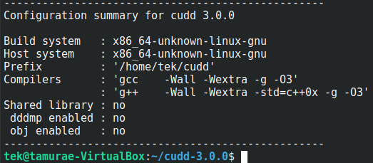

 ```bash
 $ make -j$(nproc)
 $ make install

 ```
 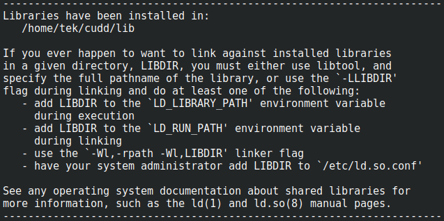

 ```bash
 $ cd  
 ```

</details>

#### [OpenSTA](https://github.com/parallaxsw/OpenSTA)

<details>
<summary>Build and install OpenSTA</summary>

 ```bash
 $ git clone https://github.com/parallaxsw/OpenSTA.git
 $ cd OpenSTA
 $ mkdir build
 $ cd build
 $ cmake -DCUDD_DIR=$HOME/cudd ..
 ```
 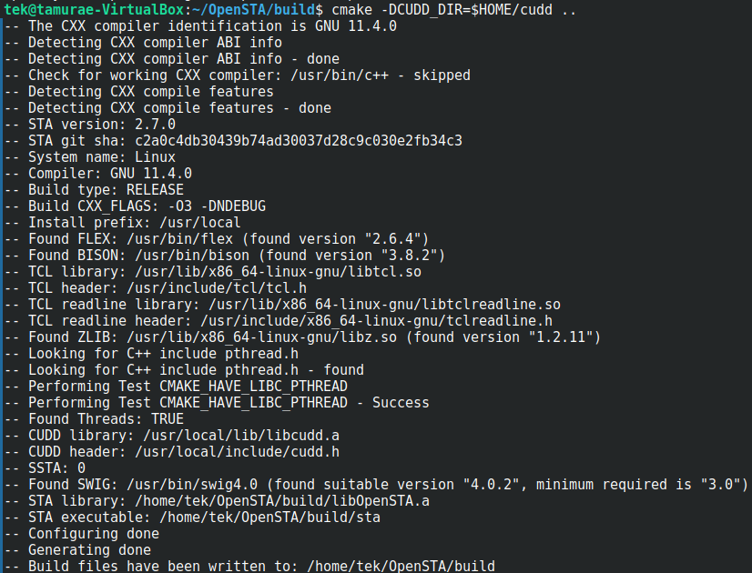

 ```bash
 $ make -j$(nproc)
 $ ./sta

 ```
 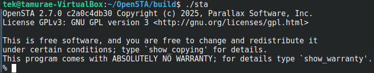

 ```bash
 $ cd  
 ```

</details>

### Timing Analysis Example using the command line

<details>
<summary>Example Circuit</summary>

 ```
 $ cd OpenSTA/examples/
 $ yosys
 > read_liberty -lib nangate45_slow.lib.gz
 > read_verilog example1.v
 > synth -top top
 > show
 ```
 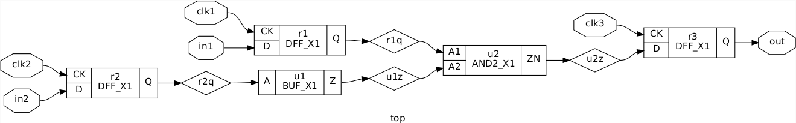

</details>

<details>
<summary>Clock Setup Analysis for Register-to-Register Path</summary>

  ```
  $ sta
  % read_liberty nangate45_slow.lib.gz
  % read_verilog example1.v
  % link_design top
  % create_clock -name clk -period 10 {clk1 clk2 clk3}
  % set_input_delay -clock clk 0 {in1 in2}
  % report_checks
 ```
 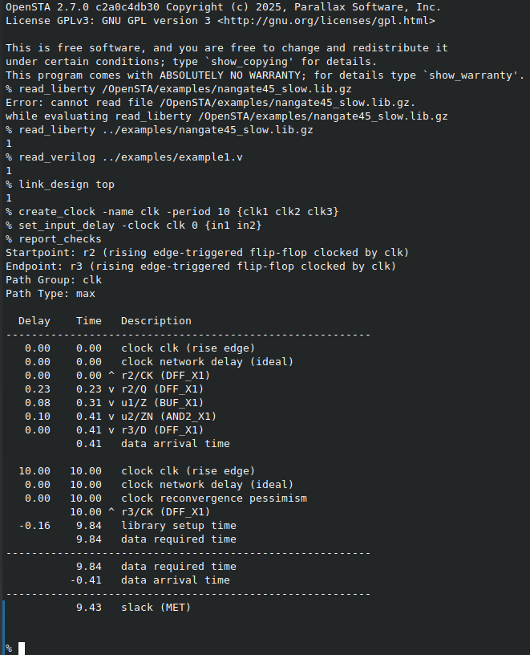

 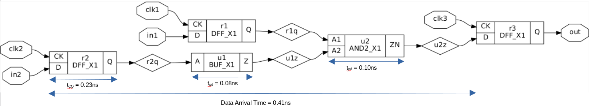

</details>

> [!NOTE]  
> The previous analysis did not consider wiring delays

<details>
<summary>Clock Setup Analysis for Register-to-Register Path considering wiring</summary>

This analysis requires using the corresponding [SPEF](https://www.vlsisystemdesign.com/spef-format-part-1/) (Standard Parasitic Exchange Format) file for the circuit

  ```
  $ sta
  % read_liberty nangate45_slow.lib.gz
  % read_verilog example1.v
  % link_design top
  % read_spef example1.dspef
  % create_clock -name clk -period 10 {clk1 clk2 clk3}
  % set_input_delay -clock clk 0 {in1 in2}
  % report_checks
 ```
 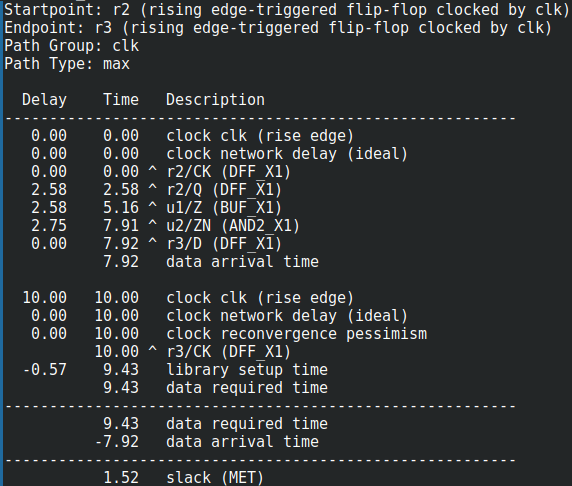

 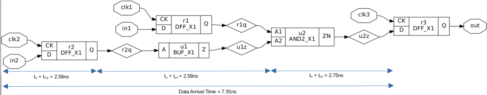

</details>

### Timing Analysis Example using a [Tcl](https://wiki.tcl-lang.org/page/Tcl+Tutorial+Index) script

<details>
<summary>Clock Setup (max path) and Hold (min path) Analysis</summary>
  
  ```
  $ sta
  % source min_max_delays.tcl
 ```
 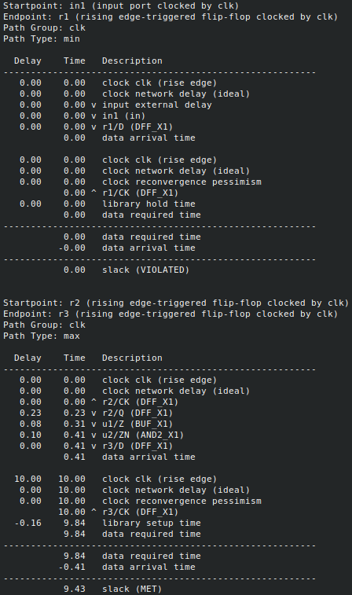

</details>

### VSDBabySoC Setup and Hold Analysis

<details>
<summary>Preparing required files</summary>
  
  ```bash
$ cd OpenSTA/examples
$ mkdir timing_libs/
$ cp ../../VSDBabySoC/src/lib/* timing_libs/
$ mkdir BabySOC
$ cp ../../VSDBabySoC/output/post_synth_sim/vsdbabysoc.synth.v BabySOC/
$ cp ../../VSDBabySoC/src/sdc/vsdbabysoc_synthesis.sdc BabySOC/
$ cp gcd_sky130hd.sdc BabySOC/
$ ls -l timing_libs/ BabySOC/
  ```
 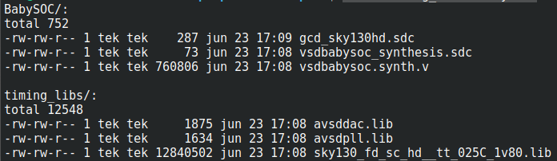


You'll also need a TCL file (save it in the BabySOC directory):
  ```
#
#   vsdbabysoc_min_max_delays.tcl
#

# Read timing characteristics libraries (Sky130A standard cells)
read_liberty -min ../timing_libs/sky130_fd_sc_hd__tt_025C_1v80.lib
read_liberty -max ../timing_libs/sky130_fd_sc_hd__tt_025C_1v80.lib

# Read timing characteristics libraries (avsdpll IP)
read_liberty -min ../timing_libs/avsdpll.lib
read_liberty -max ../timing_libs/avsdpll.lib

# Read timing characteristics libraries (avsddac IP)
read_liberty -min ../timing_libs/avsddac.lib
read_liberty -max ../timing_libs/avsddac.lib

# Read vsdbabysoc gate-level synthesized netlist
read_verilog vsdbabysoc.synth.v

# Link the top-level module to the timing characteristics libraries
link_design vsdbabysoc

# Read SDC constraints
read_sdc vsdbabysoc_synthesis.sdc

# Generate timing report
report_checks -path_delay min_max
  ```

  ```
$ cd BabySOC/
$ sta
% source vsdbabysoc_min_max_delays.tcl
  ```
 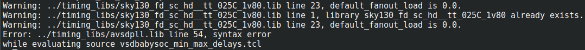

</details>

> [!IMPORTANT]
> Using a text editor, open the ``avsdpll.lib`` file. The offending line says:

``    //pin (GND#2) {``

Modify the line as follows:

``    /*pin (GND#2) {``

Find the closing matching brace and modify the line as follows:

``    /}*/``

Repeat this procedure for all instances with this pattern.

<details>
<summary>Getting results</summary>

  ```
% source vsdbabysoc_min_max_delays.tcl
  ```
 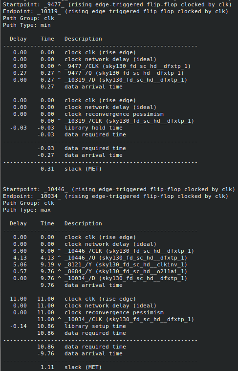

</details>

### VSDBabySoC [PVT Corners](https://www.physicaldesign4u.com/2020/07/pvt-process-voltage-temperature.html) Analysis

